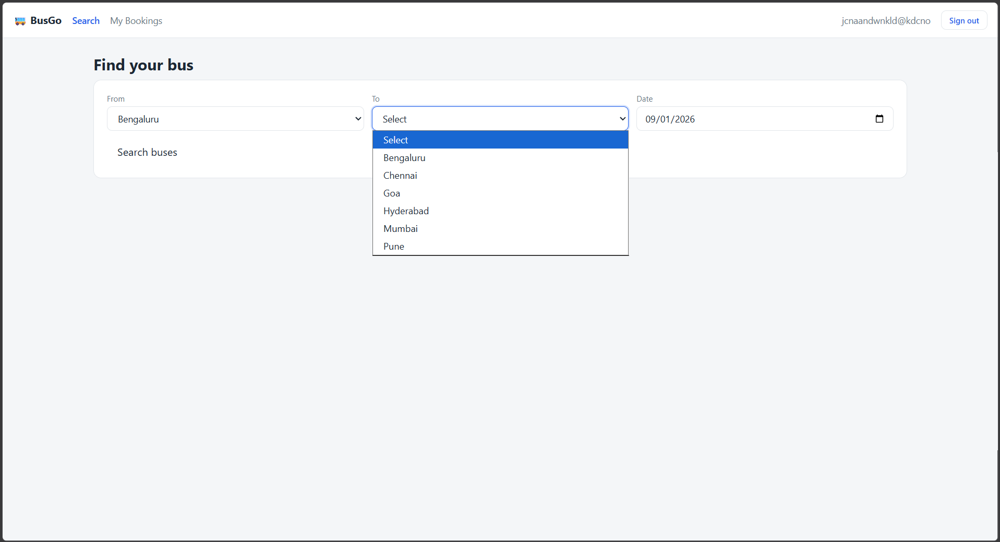
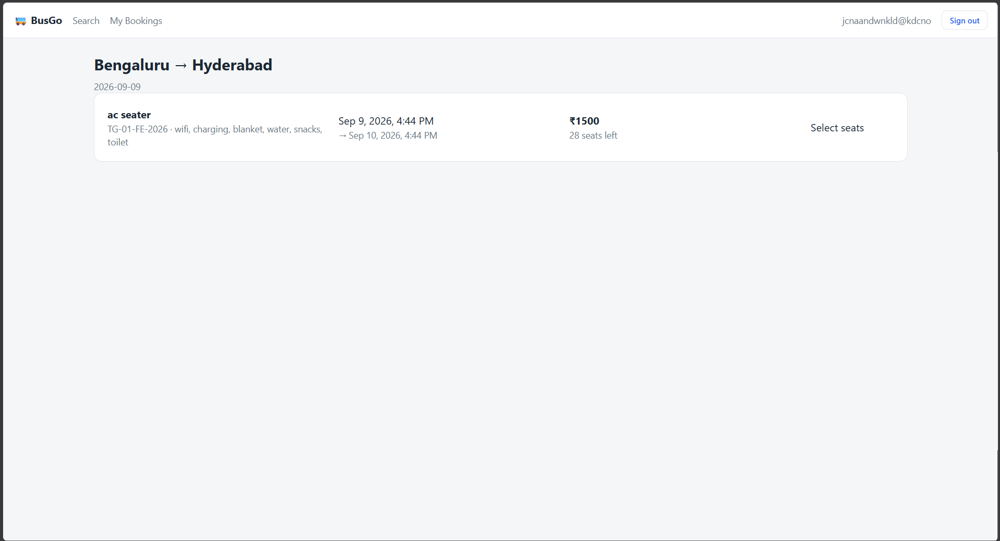
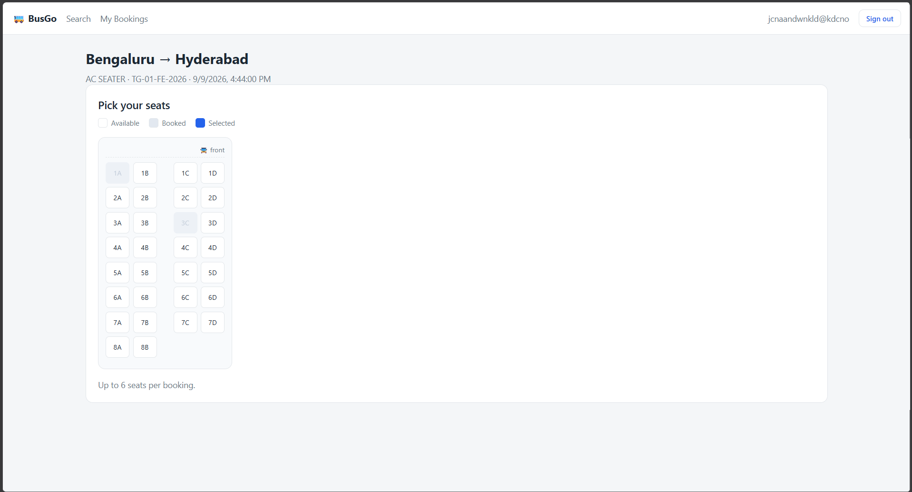
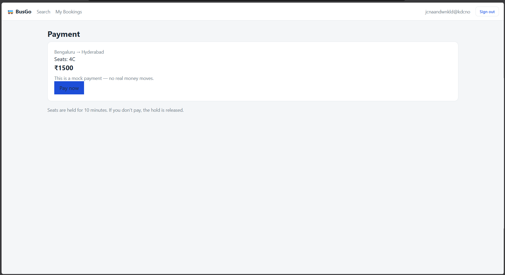
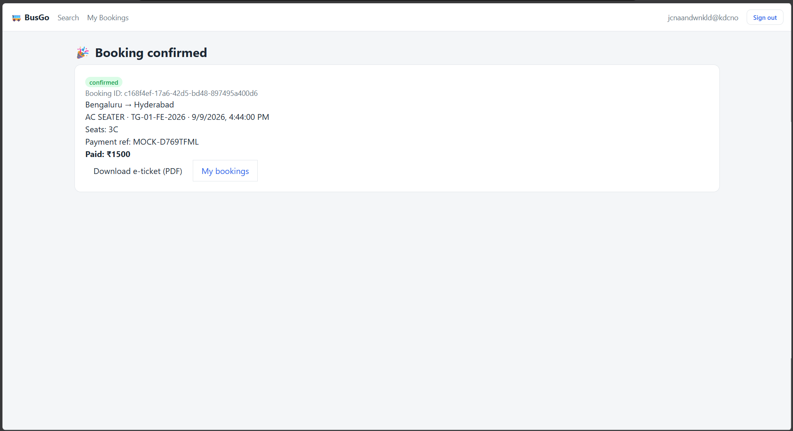
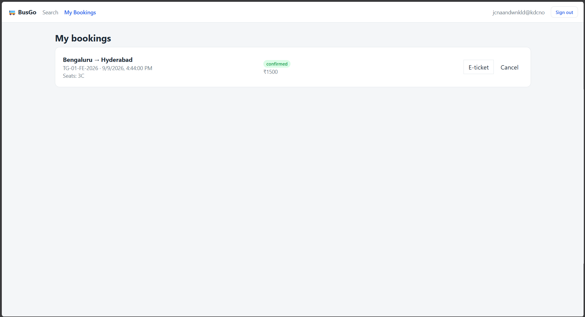
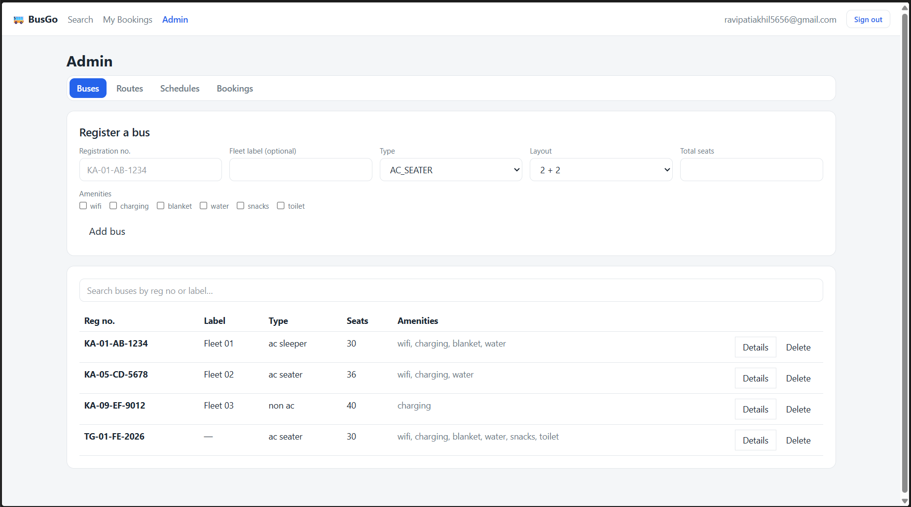
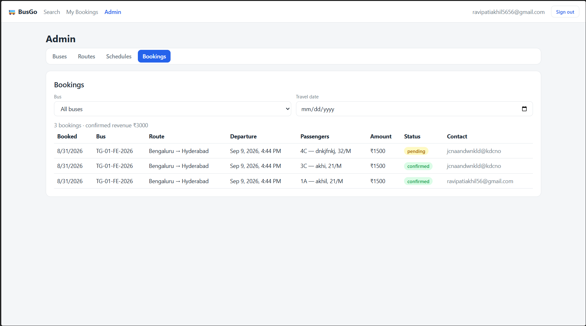

# Bus booking web app

A small intercity bus booking site for a single operator (the way FlixBus, Zingbus
or IntrCity run their own fleet). Passengers search trips, pick seats, pay, and get
a PDF ticket. An admin area manages the fleet, routes, schedules and bookings.

Stack: React (Vite) on the front end, Express on the back end, Supabase (Postgres +
Auth) for data and login.


## Screenshots

### Passenger flow

| | |
| --- | --- |
| Search | Results |
|  |  |
| Seat selection | Payment (mock) |
|  |  |
| Confirmation | My bookings |
|  |  |

### Admin

| | |
| --- | --- |
| Fleet | Bookings |
|  |  |


## Project layout

```
frontend/          React app (Vite + Tailwind CSS v4)
  src/
    lib/            supabase client, API wrapper, seat-map helpers, config
    context/        AuthContext (session + profile)
    components/     Navbar, ProtectedRoute, SeatMap
    pages/          Home, SearchResults, SeatSelection, Payment,
                    BookingConfirmation, MyBookings, Login, Signup
    pages/admin/    AdminDashboard (Buses / Routes / Schedules / Bookings tabs)

backend/           Express API
  src/
    index.js        app setup, route mounting, error handler
    supabase.js     service_role client
    middleware/     auth.js  (verifyUser, requireAdmin)
    routes/         schedules.js, bookings.js, admin.js
    lib/ticket.js   PDF e-ticket (pdfkit)

supabase/
  schema.sql        tables, RLS policies, the create_booking function, sample data
```


## Prerequisites

- Node 18 or newer
- A free Supabase project (https://supabase.com)


## Setup

### 1. Supabase

Create a project. From Project Settings to API, copy three values:

- Project URL
- `anon` public key
- `service_role` secret key

Open the SQL editor and run the whole of `supabase/schema.sql`. It creates the
tables, the RLS policies, the `create_booking` function, and inserts a handful of
sample cities, routes, buses and trips. Running it again is safe; it resets the
sample data but leaves user accounts alone.

### 2. Backend

```
cd backend
cp .env.example .env
# edit .env: set SUPABASE_URL and SUPABASE_SERVICE_ROLE_KEY
npm install
npm run dev
```

The API listens on http://localhost:4000. Check http://localhost:4000/api/health.

### 3. Frontend

```
cd frontend
cp .env.example .env
# edit .env: set VITE_SUPABASE_URL and VITE_SUPABASE_ANON_KEY
npm install
npm run dev
```

The app runs on http://localhost:5173.

### 4. Make yourself an admin

Sign up through the app first, then in the Supabase SQL editor:

```sql
update profiles set role = 'admin'
where id = (select id from auth.users where email = 'you@example.com');
```

Reload the app and an "Admin" link appears in the nav.

During development it is easier to turn off email confirmation in Supabase
(Authentication to Providers to Email, uncheck "Confirm email"). Otherwise the
built-in mailer is rate limited to a few messages per hour and new signups will
hit "email rate limit exceeded".


## Environment variables

### backend/.env

| Variable | Purpose |
| --- | --- |
| `PORT` | API port, default 4000 |
| `COMPANY_NAME` | Operator name printed on the PDF ticket |
| `CLIENT_ORIGIN` | Allowed CORS origin, default http://localhost:5173 |
| `SUPABASE_URL` | Project URL |
| `SUPABASE_SERVICE_ROLE_KEY` | Secret key. Server only. Never expose it. |
| `TZ_OFFSET_MINUTES` | Operator timezone offset for date searches, default 330 (IST) |

### frontend/.env

| Variable | Purpose |
| --- | --- |
| `VITE_SUPABASE_URL` | Project URL |
| `VITE_SUPABASE_ANON_KEY` | Public key, safe in the browser |
| `VITE_API_URL` | Base URL of the Express API, default http://localhost:4000/api |
| `VITE_COMPANY_NAME` | Operator name shown in the UI |


## How a booking flows

1. On the home page the user picks origin, destination and a date. The search page
   calls `GET /api/schedules/search`, which returns matching active trips for that
   day (in the operator's local timezone) that have not already departed, each with
   a seats-left count.
2. Selecting a trip opens the seat map (`GET /api/schedules/:id/seats`), which
   returns the bus layout plus the list of already-booked seats.
3. The user picks up to six seats and fills in a passenger name per seat, then the
   page calls `POST /api/bookings`. The server checks the seats exist on that bus
   and calls the `create_booking` Postgres function, which, in one transaction,
   creates a `pending` booking and inserts the seat rows. A unique constraint on
   `(schedule_id, seat_no)` makes a double booking impossible; if it fires, the
   whole transaction rolls back and the API returns 409.
4. The payment page calls `POST /api/bookings/:id/pay`. This is a mock: it sets the
   booking to `confirmed` and stores a fake payment reference. There is no real
   gateway.
5. The confirmation page and "My bookings" can download the ticket from
   `GET /api/bookings/:id/ticket`, which returns a PDF generated with pdfkit.

A `pending` booking older than ten minutes is treated as expired everywhere it is
read: its seats drop out of the taken list and seats-left counts, "My bookings"
shows it as `expired`, and `/pay` refuses it. The row itself is deleted the next
time someone books that trip.


## Database

All tables have RLS enabled. The `anon` role can read the catalogue tables and a
user can read their own profile and bookings; every write goes through the server.

| Table | Notes |
| --- | --- |
| `profiles` | One row per auth user. `role` is `user` or `admin`. Created automatically by a trigger on signup. |
| `cities` | Name only. |
| `routes` | An origin city and a destination city, plus optional distance. |
| `buses` | One operator's fleet. Identified by `reg_no`. Has `bus_type`, `total_seats`, `amenities` (jsonb array), and `seat_map` (jsonb array of seat labels). |
| `schedules` | A bus assigned to a route with departure, arrival and fare. `status` is `active` or `cancelled`. A GiST exclusion constraint stops one bus being scheduled for two overlapping active trips, and a check constraint enforces arrival after departure. |
| `bookings` | Belongs to a user and a schedule. `status` is `pending`, `confirmed` or `cancelled`. |
| `booking_seats` | One row per seat per booking, with passenger details. `unique (schedule_id, seat_no)` is the double-booking guard. |

`create_booking(p_user_id, p_schedule_id, p_seats, p_contact_email, p_contact_phone)`
is a `security definer` function that does the atomic insert described above.


## API reference

Everything is under `/api`. Endpoints that need a login expect an
`Authorization: Bearer <supabase access token>` header; admin endpoints also
require the caller's profile role to be `admin`.

### Public

| Method | Path | Description |
| --- | --- | --- |
| GET | `/health` | Liveness check |
| GET | `/schedules/search?origin=&dest=&date=` | Active, not-yet-departed trips for a day |
| GET | `/schedules/:id/seats` | Seat layout and taken seats for a trip |

### Authenticated user

| Method | Path | Description |
| --- | --- | --- |
| GET | `/bookings` | The caller's bookings |
| POST | `/bookings` | Create a booking and hold the seats |
| POST | `/bookings/:id/pay` | Mock payment, marks the booking confirmed |
| POST | `/bookings/:id/cancel` | Cancel and release the seats |
| GET | `/bookings/:id/ticket` | PDF e-ticket, only after payment |

### Admin

| Method | Path | Description |
| --- | --- | --- |
| GET/POST/DELETE | `/admin/cities` , `/admin/cities/:id` | Manage cities |
| GET/POST/DELETE | `/admin/routes` , `/admin/routes/:id` | Manage routes |
| GET/POST/PUT/DELETE | `/admin/buses` , `/admin/buses/:id` | Manage the fleet |
| GET | `/admin/buses/:id/overview` | One bus with its trips and per-trip load |
| GET/POST/PUT/DELETE | `/admin/schedules` , `/admin/schedules/:id` | Manage schedules; GET takes `bus_id`, `route_id`, `date` filters |
| GET | `/admin/bookings` | All bookings; takes `bus_id`, `schedule_id`, `date` filters |


## Admin area

Four tabs:

- **Buses** — register a bus by registration number, choose the type and seat
  count, tick amenities, and see a live preview of the generated seat map. The
  list has a text filter, and "Details" expands a per-bus view of every trip that
  bus runs with how full each one is.
- **Routes** — add cities, then add routes between them.
- **Schedules** — assign a bus to a route with departure, arrival and fare. The
  form shows the parsed departure date back to you so a wrong month is obvious, and
  refuses past dates and overlaps. The list filters by bus, route and date and
  shows seats sold per trip. Trips can be cancelled and reactivated.
- **Bookings** — every booking, filterable by bus and travel date, with passenger
  details and a confirmed-revenue total.


## Seat maps

A bus `seat_map` is stored as a flat array of seat labels. Seater buses use
`1A, 1B, 1C, 1D, 2A, ...`; sleepers use `L1..Ln` for the lower deck and `U1..Un`
for the upper. The front end turns that flat list into a laid-out grid: an aisle
down the middle for seaters (2+2 or 2+1), two decks for sleepers. The admin form
generates the labels from the type, seat count and layout choice.


## Payments

Mock only. `POST /api/bookings/:id/pay` sets the booking to `confirmed` and stores
a reference like `MOCK-XXXXXXXX`. To use a real gateway you would replace that
endpoint with one that creates a payment intent, and confirm the booking from the
provider's webhook instead.


## Production build

```
cd frontend
npm run build      # output in frontend/dist
npm run preview    # serve the build locally to check it
```

`frontend/dist` is static and can go on any static host. Set `VITE_API_URL` at
build time to wherever the API is deployed. The backend is a plain Node process;
`npm start` runs it.


## Things left out

This is a learning project, not production software. Notable gaps:

- The mock payment. No refunds.
- The overlap check is purely time based. It does not verify the bus is actually
  at the origin city, and there is no turnaround buffer between trips.
- No email or SMS. Tickets are download only.
- No pricing rules, discounts, or seat-level pricing (sleeper lower vs upper, etc).

